# WANTERA

**Want It. Find It. Love It.**

A full-stack e-commerce platform built from scratch using React, TypeScript, Node.js, Express, MongoDB, and real Razorpay payment integration — deployed and running in production.

🔗 **Live site:** [wantera-ecommerce.vercel.app](https://wantera-ecommerce.vercel.app)
🔗 **API:** [wantera-api.onrender.com](https://wantera-api.onrender.com)

> Note: the backend is hosted on Render's free tier, which spins down after inactivity — the first request after idle time may take 30–60 seconds to respond while it wakes up.

---

## Why I built this

I built WANTERA to really understand the full MERN stack by working on something with real stakes — not another to-do app, but a project involving actual payments, real security concerns, and enough moving parts that I had to understand what I was doing. I wanted to be able to walk into interviews and explain *why* I made specific decisions, not just say that I followed a tutorial.

A few things I'm genuinely proud of getting right:
- The access/refresh token auth flow with rotation — I understand exactly why each piece exists, down to why the refresh token lives in an httpOnly cookie instead of localStorage.
- The Razorpay integration uses a webhook as the actual source of truth for payment confirmation, not just the frontend callback — so a payment still gets recorded correctly even if someone closes their browser right after paying.
- Every price shown at checkout is recalculated server-side, never trusted from the frontend.

Deployment was honestly the hardest part — harder than building most of the features. I ran into a chain of real production issues: a TypeScript version mismatch that appeared on Render but not locally, a filename-casing bug that worked on Windows but broke the Linux build (`User.ts` vs `user.ts`), and an Express `trust proxy` setting I didn't know I needed until rate limiting started throwing errors behind Render's reverse proxy. Working through each problem taught me more about how these tools actually behave in production than any tutorial could.

This project is still evolving — see the Roadmap section below for what's next.

---

## Screenshots

### Customer Experience

| Home | Shop |
|---|---|
| 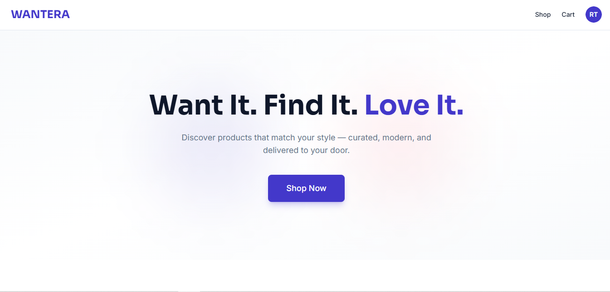 | 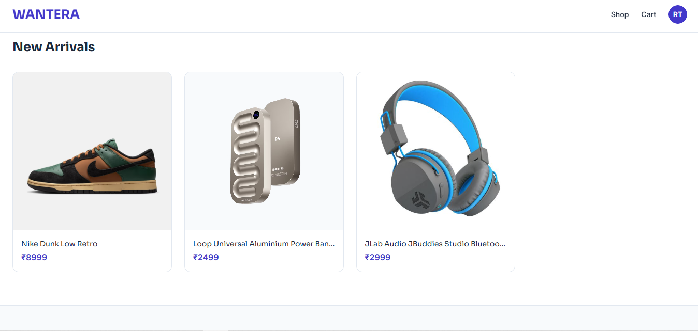 |
[Shop with filters](docs/screenshots/shop.png) |

| Product Details | Product Category Filter |
|---|---|
| 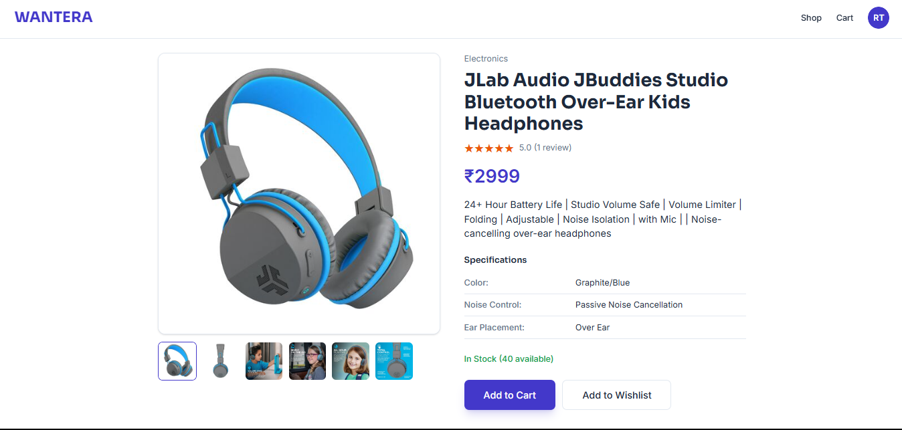 | 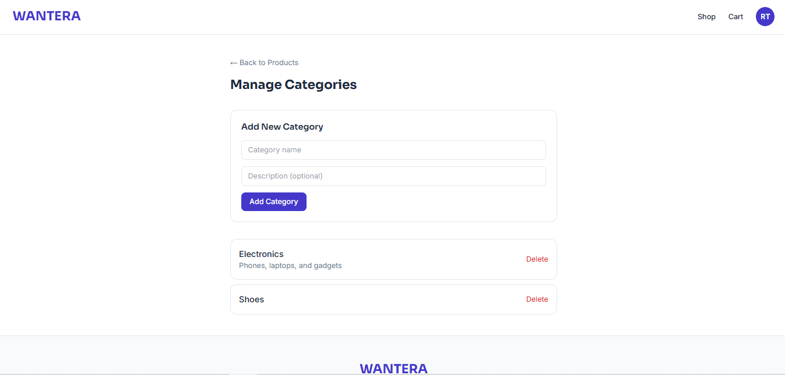 |

| Product Reviews | Wishlist |
|---|---|
| 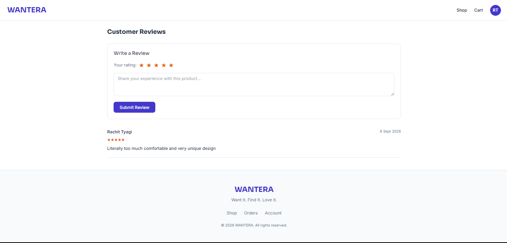 | 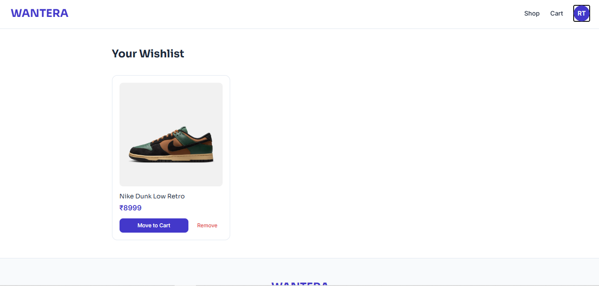 |

| Cart | Order History |
|---|---|
| 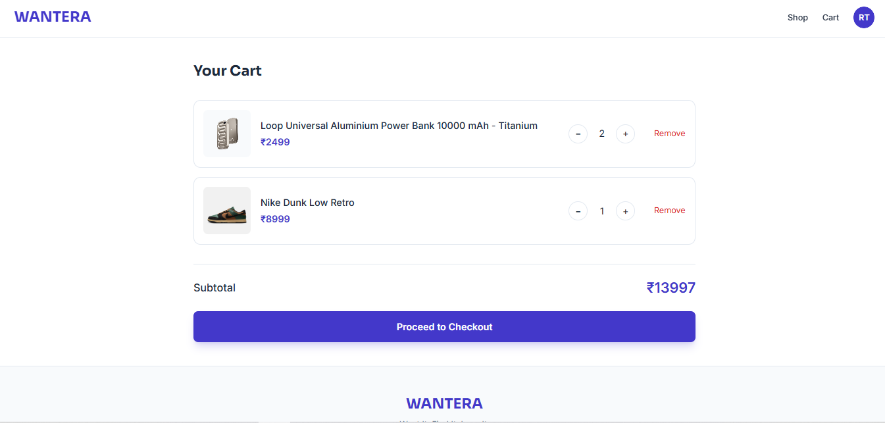 | 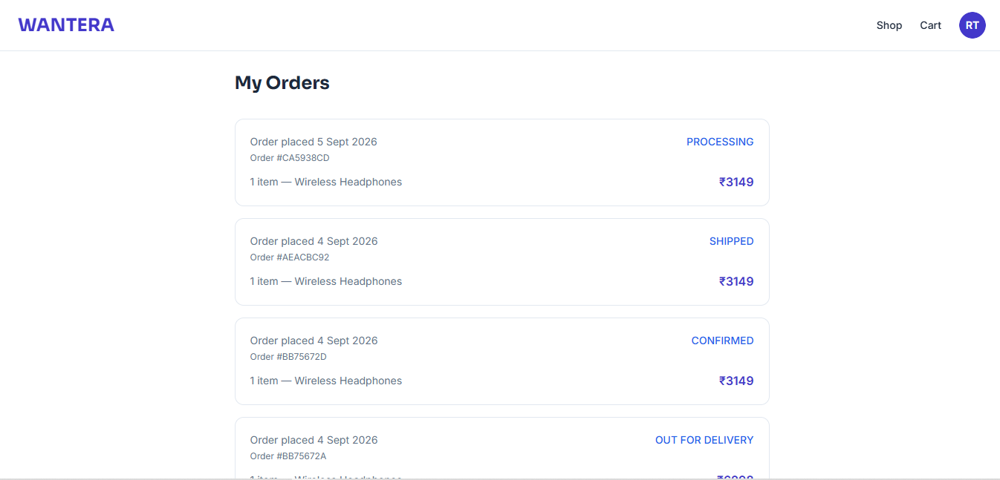 |

| Order Tracking |
|---|
| 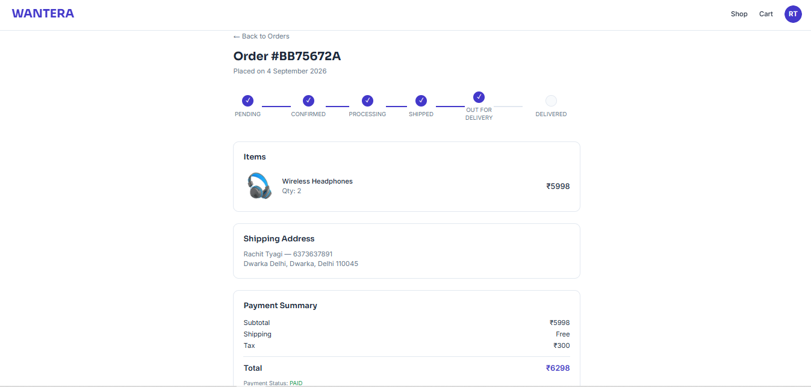 |

### Admin Dashboard

| Dashboard Overview | Manage Products |
|---|---|
| 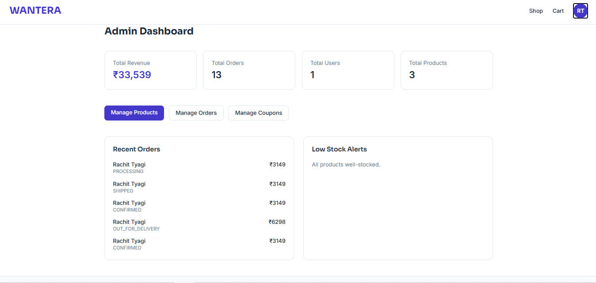 | 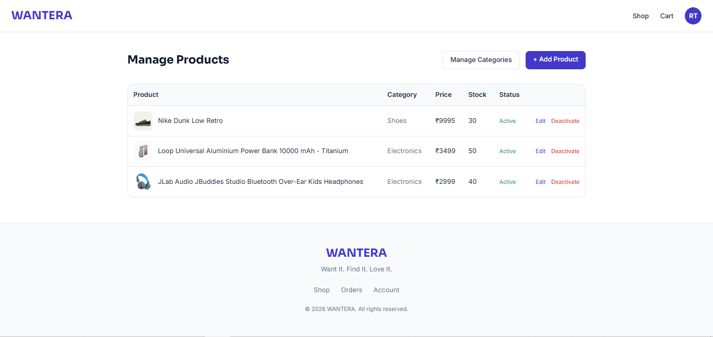 |

| Add New Product | Manage Orders |
|---|---|
| 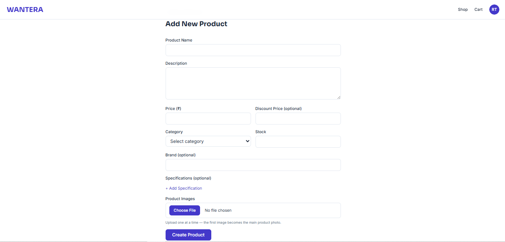 | 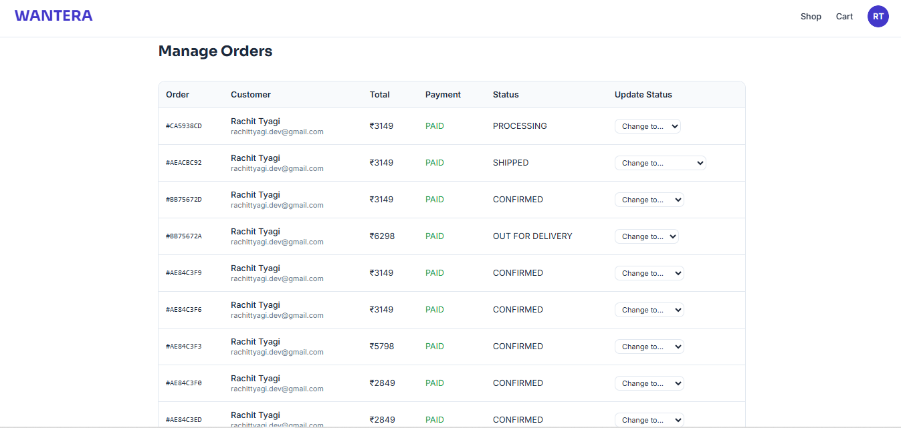 |

| Manage Coupons |
|---|
| 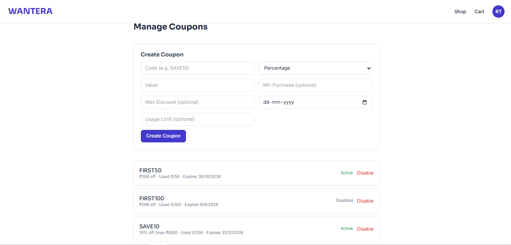 |

---

## Overview

WANTERA is a complete shopping experience — customers can browse and search products, manage a wishlist and cart, check out using saved addresses and coupon codes, and pay securely through Razorpay (Test Mode). Admins can manage the catalog, orders, users, and coupons from a full dashboard. The features are built around real application flows — no mocked data or fake payment success states.

## Features

### Customer
- Authentication with JWT access + refresh token rotation, session persistence across page reloads
- Product browsing with keyword search, category/price filtering, sorting, and pagination
- Multiple product images per listing with a swipeable, thumbnail-navigable gallery
- Product specifications table and customer reviews with star ratings
- Wishlist and cart with real-time stock validation
- Multiple saved shipping addresses
- Coupon codes with percentage/fixed discounts and maximum-discount caps
- Server-side checkout total calculation (never trusts frontend pricing)
- Real Razorpay payments with signature verification and webhook confirmation
- Order history and order tracking with a visual status timeline
- Profile management and secure password change
- Toast notifications for all feedback (no native browser alerts)

### Admin
- Dashboard with live analytics: revenue, order/user/product counts, recent orders, low-stock alerts
- Product CRUD with multi-image Cloudinary upload and specifications editor
- Category management
- Coupon management
- Order management with status transitions validated against an allowed-transition map

## Technology Stack

| Layer | Technology |
|---|---|
| Frontend | React, TypeScript, Vite, Tailwind CSS, shadcn/ui, Redux Toolkit, RTK Query |
| Backend | Node.js, Express, TypeScript |
| Database | MongoDB Atlas, Mongoose |
| Authentication | JWT (access + refresh rotation), httpOnly cookies, bcrypt |
| Validation | Zod |
| Payments | Razorpay (Test Mode) |
| Images | Cloudinary |
| Email | Nodemailer |
| Testing | Jest, Supertest |
| Security | Helmet, rate limiting, custom NoSQL sanitization |
| Deployment | Vercel (frontend), Render (backend), MongoDB Atlas |

## Architecture

```
React (Vite/TS) → RTK Query → Express API → Mongoose → MongoDB Atlas
                                     ↓
                Cloudinary (images) / Razorpay (payments) / Nodemailer (email)
```

Every request follows the same basic path: `Route → Middleware (auth/validation/sanitization) → Controller → Model → MongoDB`.

## Folder Structure

```
wantera-ecommerce/
├── client/          React frontend
│   └── src/
│       ├── pages/          Route-level pages (including admin/)
│       ├── components/     Shared UI (shadcn components, layout guards)
│       ├── layouts/        MainLayout (navbar/footer wrapper)
│       ├── services/       RTK Query API slices, one per feature
│       ├── features/       Redux slices (auth)
│       └── store/          Redux store setup
├── server/
│   └── src/
│       ├── config/         DB, Cloudinary, Razorpay, Mailer setup
│       ├── controllers/    Request handlers
│       ├── middleware/     Auth, sanitization
│       ├── models/         Mongoose schemas
│       ├── routes/         API route definitions
│       ├── utils/          Shared helpers (tokens, slugs, coupon validation)
│       ├── validators/     Zod schemas
│       └── tests/          Jest test suites
├── docs/            Architecture, database, auth, and payment-flow documentation
└── README.md
```

## Installation

```bash
git clone https://github.com/rachittyagi01/wantera-ecommerce.git
cd wantera-ecommerce

cd server && npm install
cd ../client && npm install
```

## Environment Variables

Copy `server/.env.example` to `server/.env` and fill in your own values (MongoDB URI, JWT secrets, Razorpay keys, Cloudinary credentials, Gmail SMTP credentials). Never commit `.env`.

## Running Locally

```bash
# Terminal 1 — backend
cd server
npm run dev    # http://localhost:5000

# Terminal 2 — frontend
cd client
npm run dev    # http://localhost:5173
```

## Running Tests

```bash
cd server
npm test
```

## API Overview

| Base path | Purpose |
|---|---|
| `/api/auth` | Signup, login, refresh, logout, profile |
| `/api/products` | Product listing, search, filtering, admin CRUD |
| `/api/categories` | Category CRUD |
| `/api/cart` | Cart management with stock validation |
| `/api/wishlist` | Wishlist management |
| `/api/addresses` | Saved shipping addresses |
| `/api/checkout` | Server-calculated order summary |
| `/api/coupons` | Coupon validation and admin management |
| `/api/payments` | Razorpay order creation, verification, webhook |
| `/api/orders` | Order history and admin order management |
| `/api/reviews` | Product reviews and ratings |
| `/api/admin` | Dashboard analytics |
| `/api/upload` | Cloudinary image upload |

Full endpoint documentation: [`docs/api.md`](docs/api.md).

## Authentication Flow

Short-lived JWT access tokens (15 min) are paired with longer-lived, rotating refresh tokens (7 days) stored in httpOnly cookies. Each refresh issues a new refresh token and invalidates the previous one — so reuse of an already-rotated token becomes a theft signal. Full explanation: [`docs/authentication.md`](docs/authentication.md).

## Payment Flow

Prices are recalculated entirely on the server at checkout — the frontend never supplies a trusted amount. Payment confirmation uses two layers: fast-path signature verification from the frontend callback, plus a webhook called directly by Razorpay's servers as the source of truth, with an idempotency check to prevent duplicate processing. Full explanation: [`docs/payment-flow.md`](docs/payment-flow.md).

## Database

Core collections: User, Product, Category, Cart, Wishlist, Address, Order, Coupon, Review. Products use a soft-delete (`isActive`) pattern so historical orders remain accurate. Orders store line-item snapshots (name and price at the time of purchase) instead of relying on live product data. Full schema documentation: [`docs/database.md`](docs/database.md).

## Deployment

Frontend on Vercel, backend on Render, database on MongoDB Atlas, images on Cloudinary — all free-tier. Full steps: [`docs/deployment.md`](docs/deployment.md).

## Roadmap

Currently working on:
- **Email verification on signup** — schema field exists (`isVerified`), verification email flow not yet implemented
- **Full mobile responsiveness audit** — responsive fixes applied reactively (admin tables, header layouts, product cards); a deliberate pass across every page is planned

## Author

**Name:** Rachit Tyagi
**GitHub:** [rachittyagi01](https://github.com/rachittyagi01)
**LinkedIn:**
**Email:**
