<div align="center">

# WANTERA

**Want It. Find It. Love It.**

A full-stack e-commerce platform built from scratch with React, TypeScript, Node.js, Express, MongoDB, and real Razorpay payment integration — deployed and live in production.

<br />


<br />

[](https://wantera-ecommerce.vercel.app)
[](https://www.linkedin.com/in/rachittyagi1200/)
[](mailto:tyagirachitrt@gmail.com)
[](https://github.com/rachittyagi01)

</div>

---

🔗 **Live site:** [wantera-ecommerce.vercel.app](https://wantera-ecommerce.vercel.app)
🔗 **API:** [wantera-api.onrender.com](https://wantera-api.onrender.com)

> Note: the backend is hosted on Render's free tier, which spins down after inactivity — the first request after idle time may take 30–60 seconds to respond while it wakes up.

> Verification and confirmation emails are sent from Resend's shared sandbox domain (no custom domain is configured for this portfolio project), so they may land in spam on first delivery.

---

## Why I built this

I built WANTERA to go deep on the full MERN stack with a project that had real stakes — not another to-do app, but something with actual payment processing, real security concerns, and enough moving parts that I couldn't fake my way through it. I wanted to walk into interviews able to explain *why* I made specific decisions, not just that I followed a tutorial.

A few things I'm genuinely proud of getting right:
- The access/refresh token auth flow with rotation — I understand exactly why each piece exists, down to why the refresh token lives in an httpOnly cookie instead of localStorage.
- The Razorpay integration uses a webhook as the actual source of truth for payment confirmation, not just the frontend callback — so a payment still gets recorded correctly even if someone closes their browser right after paying.
- Every price shown at checkout is recalculated server-side, never trusted from the frontend.

Deployment was honestly the hardest part — harder than writing most of the features. I hit a chain of real production issues: a TypeScript version mismatch that only showed up on Render (not locally), a filename-casing bug that worked fine on Windows but broke the Linux build (`User.ts` vs `user.ts`), and an Express `trust proxy` config I didn't know I needed until rate-limiting started throwing errors behind Render's reverse proxy. Debugging each one taught me more about how these tools actually work than any tutorial did.

Email delivery was another one: SMTP worked locally but timed out in production because Render's free tier blocks outbound SMTP, so I moved to an HTTP-based email API instead.

---

## Screenshots

### Customer Experience

| Home | Shop |
|---|---|
| 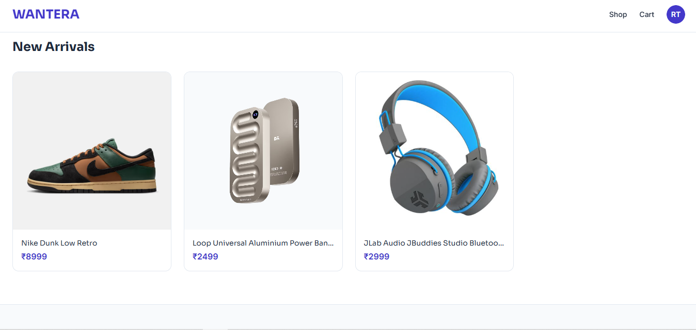 | 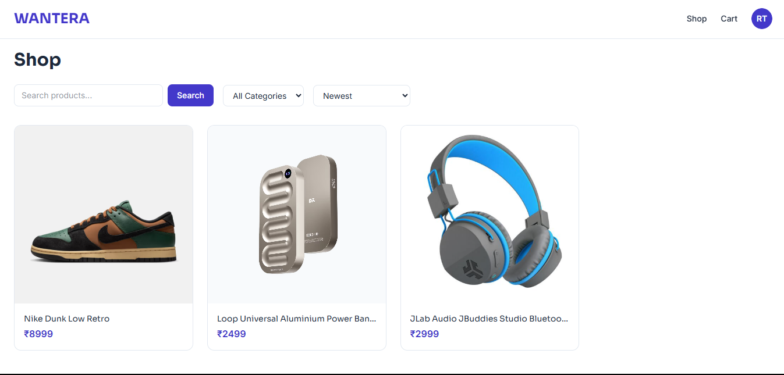 |

| Product Details | Product Category Filter |
|---|---|
| 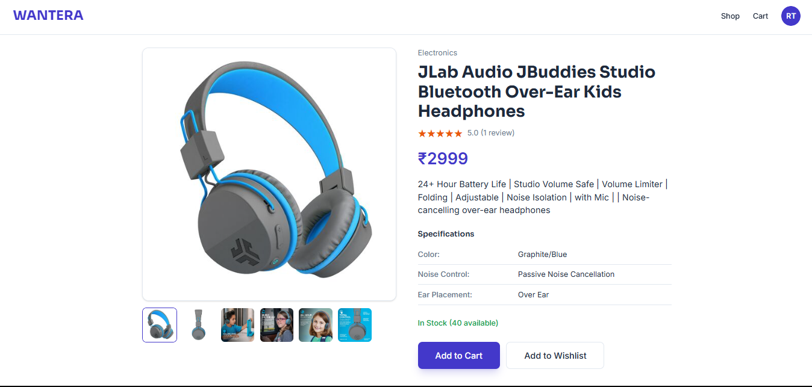 | 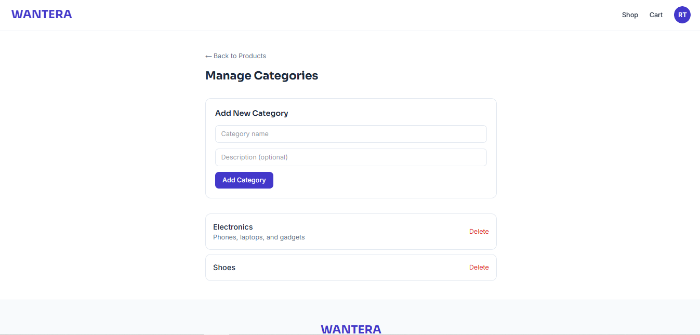 |

| Product Reviews | Wishlist |
|---|---|
| 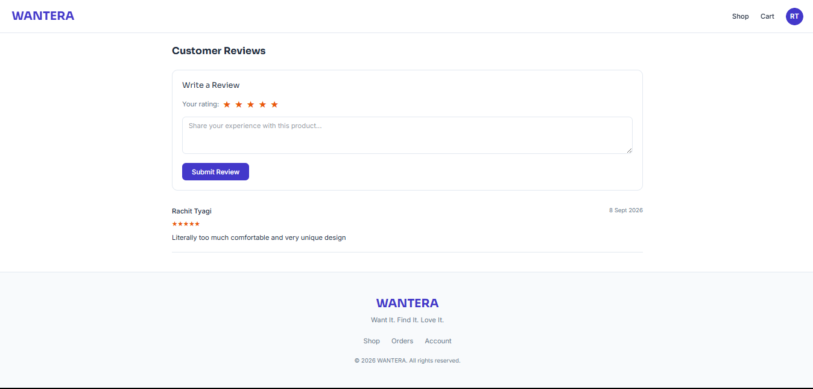 | 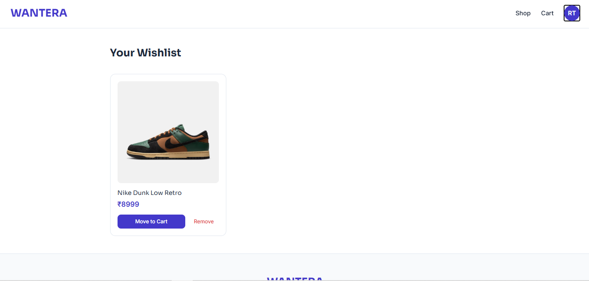 |

| Cart | Order History |
|---|---|
| 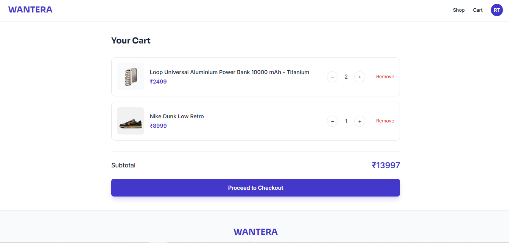 | 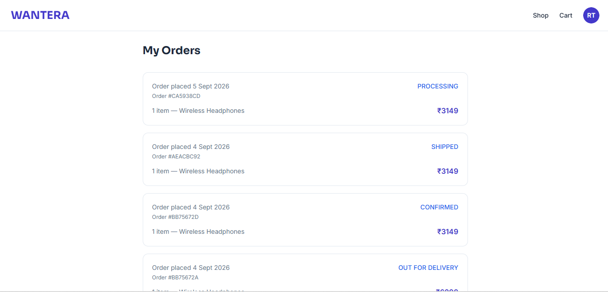 |

| Order Tracking |
|---|
| 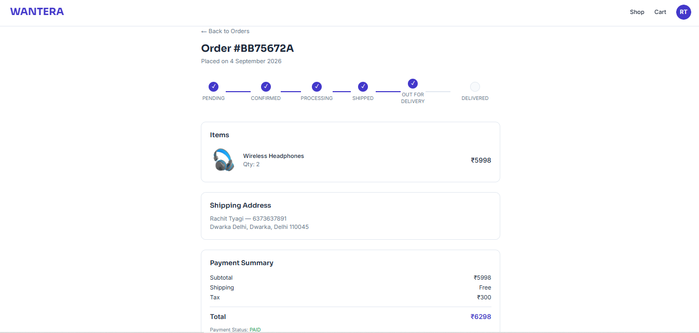 |

### Admin Dashboard

| Dashboard Overview | Manage Products |
|---|---|
| 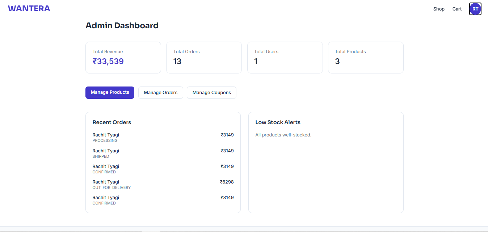 | 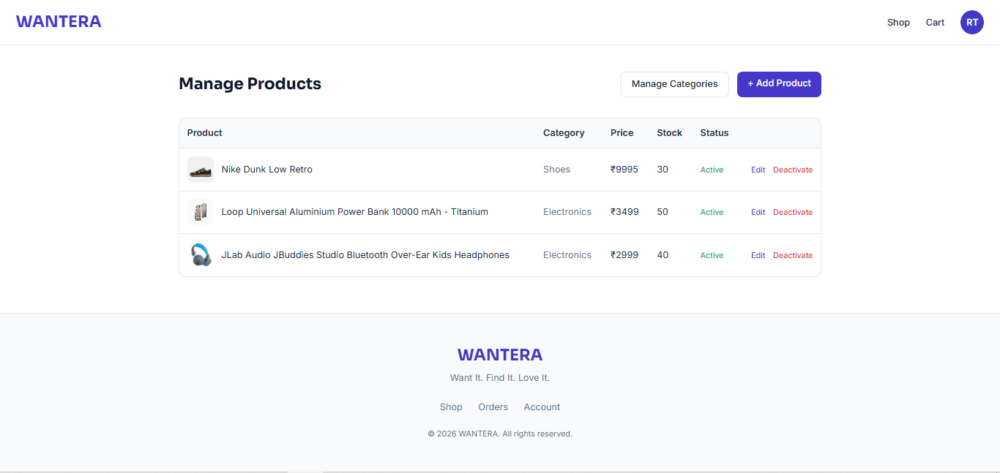 |

| Add New Product | Manage Orders |
|---|---|
| 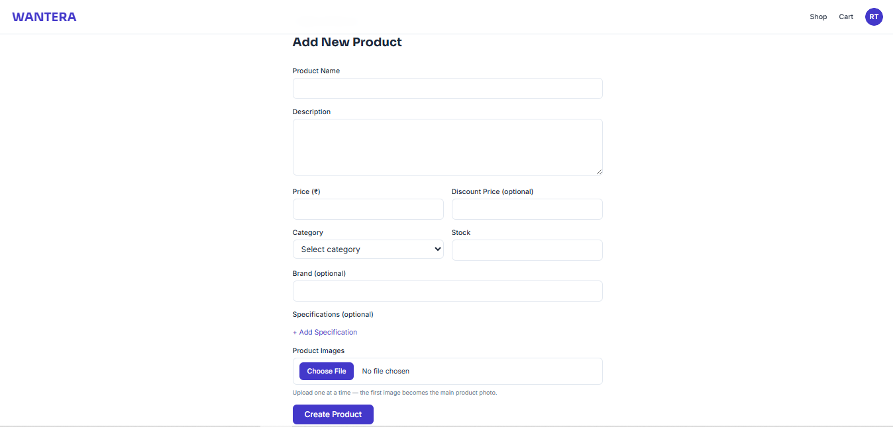 | 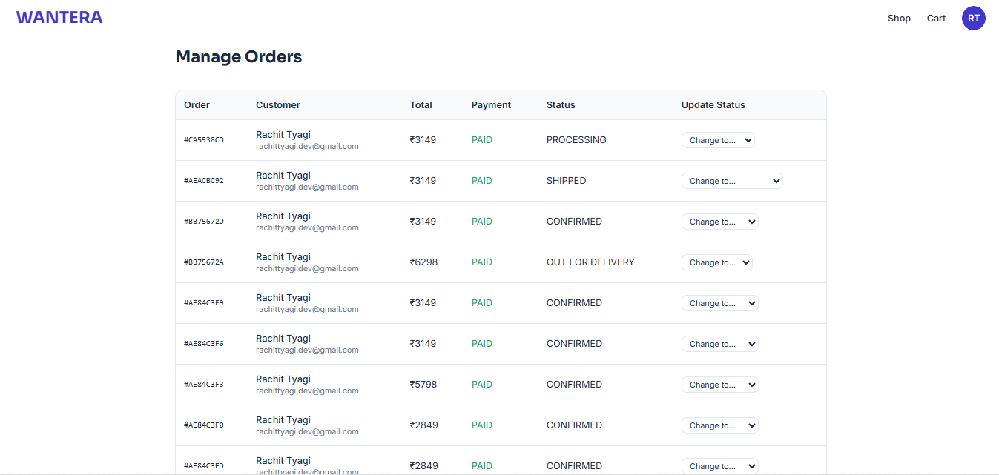 |

| Manage Coupons |
|---|
| 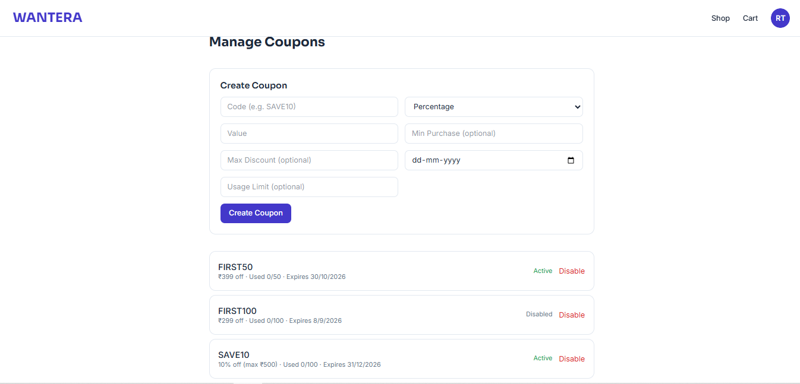 |

---

## Overview

WANTERA is a complete shopping experience — customers can browse and search products, manage a wishlist and cart, check out with saved addresses and coupon codes, and pay securely via Razorpay (Test Mode). Admins manage the entire catalog, orders, users, and coupons through a full dashboard. Every feature is fully functional — no mocked data, no fake payment success states.

## Features

### Customer
- Authentication with JWT access + refresh token rotation, session persistence across page reloads
- Email verification on signup
- Product browsing with keyword search, category/price filtering, sorting, and pagination
- Multiple product images per listing with a swipeable, thumbnail-navigable gallery
- Product specifications table and customer reviews with star ratings
- Wishlist and cart with real-time stock validation
- Multiple saved shipping addresses
- Coupon codes with percentage/fixed discounts and maximum-discount caps
- Server-side checkout total calculation (never trusts frontend pricing)
- Real Razorpay payments with signature verification and webhook confirmation
- Order history and order tracking with a visual status timeline
- Profile management and secure password change
- Toast notifications for all feedback (no native browser alerts)
- Responsive layout across mobile, tablet, and desktop

### Admin
- Dashboard with live analytics: revenue, order/user/product counts, recent orders, low-stock alerts
- Product CRUD with multi-image Cloudinary upload and specifications editor
- Category management
- Coupon management
- Order management with status transitions validated against an allowed-transition map

## Technology Stack

| Layer | Technology |
|---|---|
| Frontend | React, TypeScript, Vite, Tailwind CSS, shadcn/ui, Redux Toolkit, RTK Query |
| Backend | Node.js, Express, TypeScript |
| Database | MongoDB Atlas, Mongoose |
| Authentication | JWT (access + refresh rotation), httpOnly cookies, bcrypt |
| Validation | Zod |
| Payments | Razorpay (Test Mode) |
| Images | Cloudinary |
| Email | Resend |
| Testing | Jest, Supertest |
| Security | Helmet, rate limiting, custom NoSQL sanitization |
| Deployment | Vercel (frontend), Render (backend), MongoDB Atlas |

## Architecture

```
React (Vite/TS) → RTK Query → Express API → Mongoose → MongoDB Atlas
                                     ↓
                Cloudinary (images) / Razorpay (payments) / Resend (email)
```

Every request flows: `Route → Middleware (auth/validation/sanitization) → Controller → Model → MongoDB`.

## Folder Structure

```
wantera-ecommerce/
├── client/          React frontend
│   └── src/
│       ├── pages/          Route-level pages (including admin/)
│       ├── components/     Shared UI (shadcn components, layout guards)
│       ├── layouts/        MainLayout (navbar/footer wrapper)
│       ├── services/       RTK Query API slices, one per feature
│       ├── features/       Redux slices (auth)
│       └── store/          Redux store setup
├── server/
│   └── src/
│       ├── config/         DB, Cloudinary, Razorpay setup
│       ├── controllers/    Request handlers
│       ├── middleware/     Auth, sanitization
│       ├── models/         Mongoose schemas
│       ├── routes/         API route definitions
│       ├── utils/          Shared helpers (tokens, slugs, coupon validation, email)
│       ├── validators/     Zod schemas
│       └── tests/          Jest test suites
├── docs/            Architecture, database, auth, and payment-flow documentation
└── README.md
```

## Installation

```bash
git clone https://github.com/rachittyagi01/wantera-ecommerce.git
cd wantera-ecommerce

cd server && npm install
cd ../client && npm install
```

## Environment Variables

Copy `server/.env.example` to `server/.env` and fill in your own values (MongoDB URI, JWT secrets, Razorpay keys, Cloudinary credentials, Resend API key, frontend URL). Never commit `.env`.

## Running Locally

```bash
# Terminal 1 — backend
cd server
npm run dev    # http://localhost:5000

# Terminal 2 — frontend
cd client
npm run dev    # http://localhost:5173
```

## Running Tests

```bash
cd server
npm test
```

## API Overview

| Base path | Purpose |
|---|---|
| `/api/auth` | Signup, login, refresh, logout, profile, email verification |
| `/api/products` | Product listing, search, filtering, admin CRUD |
| `/api/categories` | Category CRUD |
| `/api/cart` | Cart management with stock validation |
| `/api/wishlist` | Wishlist management |
| `/api/addresses` | Saved shipping addresses |
| `/api/checkout` | Server-calculated order summary |
| `/api/coupons` | Coupon validation and admin management |
| `/api/payments` | Razorpay order creation, verification, webhook |
| `/api/orders` | Order history and admin order management |
| `/api/reviews` | Product reviews and ratings |
| `/api/admin` | Dashboard analytics |
| `/api/upload` | Cloudinary image upload |

Full endpoint documentation: [`docs/api.md`](docs/api.md).

## Authentication Flow

Short-lived JWT access tokens (15 min) paired with longer-lived, rotating refresh tokens (7 days) stored in httpOnly cookies. Every refresh issues a brand-new refresh token, invalidating the old one — reuse of an already-rotated token is a theft signal. Full explanation: [`docs/authentication.md`](docs/authentication.md).

## Payment Flow

Prices are recalculated entirely server-side at checkout — the frontend never supplies a trusted amount. Payment confirmation relies on two layers: a fast-path signature verification on the frontend callback, and a webhook called directly by Razorpay's servers as the actual source of truth, protected by an idempotency check. Full explanation: [`docs/payment-flow.md`](docs/payment-flow.md).

## Database

Core collections: User, Product, Category, Cart, Wishlist, Address, Order, Coupon, Review. Products use a soft-delete (`isActive`) pattern to preserve historical order accuracy. Orders store line-item snapshots (name, price at time of purchase) rather than live product references. Full schema documentation: [`docs/database.md`](docs/database.md).

## Deployment

Frontend on Vercel, backend on Render, database on MongoDB Atlas, images on Cloudinary — all free-tier. Full steps: [`docs/deployment.md`](docs/deployment.md).

## Author

**Name:** Rachit Tyagi<br>
**GitHub:** [rachittyagi01](https://github.com/rachittyagi01)<br>
**LinkedIn:** [Rachit Tyagi](https://www.linkedin.com/in/rachittyagi1200/)<br>
**Email:** [tyagirachitrt@gmail.com](mailto:tyagirachitrt@gmail.com)